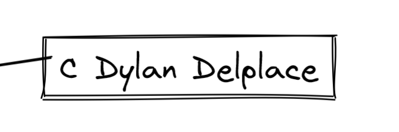

Bienvenue dans la salle B !!

Une fois dans cette salle vous regardez autour de vous et apercevez deux nouvelles portes devant vous. Avec la porte derrière vous qui vous améne à la salle E il y a une avec le nom A ainsi qu'une autre avec le nom C. Faite attention la salle Game-Over est peut-être à un pas de vous.

Dylan DELPLACE
