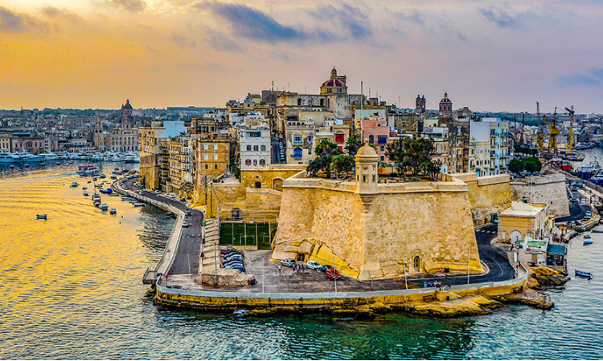
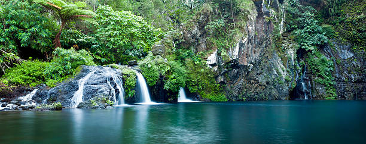

# Corse

La Corse est une île située dans la mer Méditerranée et est une seule communauté territoriale française.

La Corse, quatrième île de la Méditerranée par sa superficie, a fait partie de la République de Gênes pendant près de quatre siècles avant sa brève indépendance du 15 avril 1736 à décembre 1740.

Malte

Cuba

La Réunion

Dylan DELPLACE
