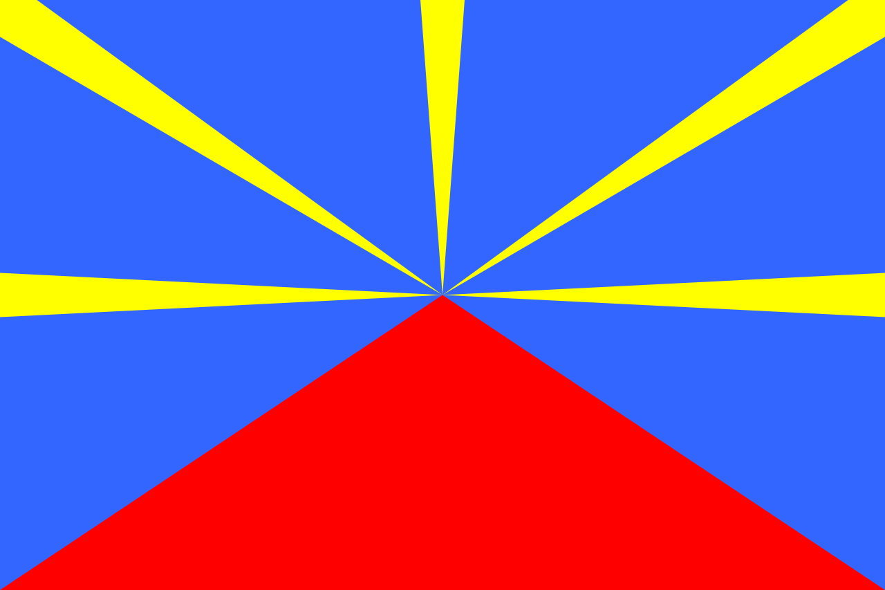

# Corse

### 

La Corse est une île située dans la mer Méditerranée et est une seule communauté territoriale française.

La Corse, quatrième île de la Méditerranée par sa superficie, a fait partie de la République de Gênes pendant près de quatre siècles avant sa brève indépendance du 15 avril 1736 à décembre 1740.

Vous avez 3 d'autres pays à découvrir, choisissez votre prochaine destination s'il vous plaît.

### Destination
Malte | Cuba | La Réunion 
:----:|:--:|:---:
<a href=https://github.com/ssagnane1/tp2-labyrinthe/blob/main/jeu-heros-sdc/Malte.md>  | <a href=https://github.com/ssagnane1/tp2-labyrinthe/blob/main/jeu-heros-sdc/Cuba.md>  | <a href=https://github.com/ssagnane1/tp2-labyrinthe/blob/main/jeu-heros-sdc/Réunion.md> 

Dylan DELPLACE
