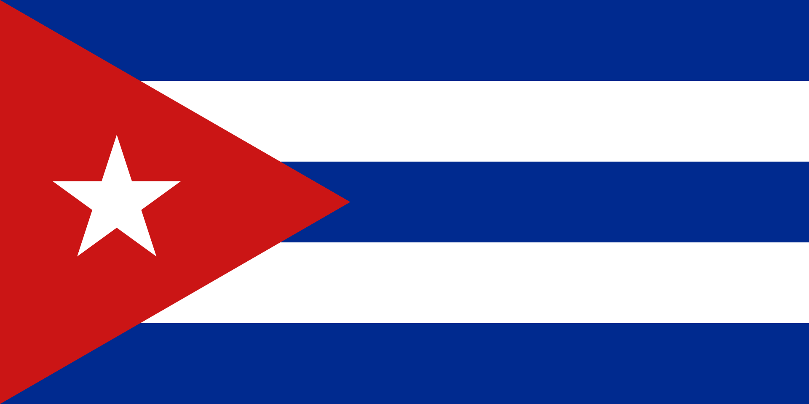

# Cuba 

### 

Cuba est un pays insulaire des Grandes Antilles, situé au sud des États-Unis et à l'est du Mexique, à 77 km à l'est d'Haïti et à 140 km au nord de la Jamaïque. 

Cuba est entourée au nord par le détroit de Floride, à l'est par l'océan Atlantique, au sud-est par le passage du Vent, au sud par la mer des Caraïbes, à l'ouest par le détroit du Yucatán. Regroupant plusieurs petits archipels autour de l'île principale de Cuba, le pays totalise une superficie de 110 860 km2. Sa capitale est La Havane.

Malheureusement vous ne pouvez plus aller dans d'autres destination, retournez à la case départ.

Dylan DELPLACE
