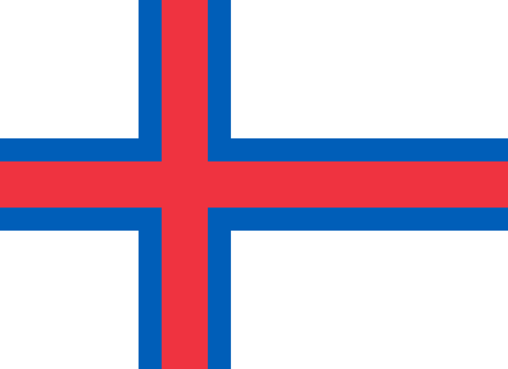
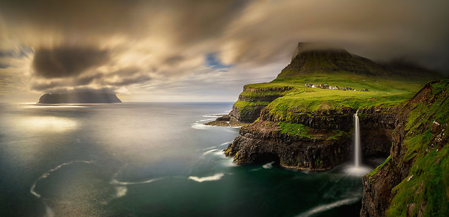

# Îles Féroé

Bravo à vous, vous êtes sortie du labyrinthe.

### 

Les Îles Féroé sont l'un des trois pays constitutifs du royaume de Danemark, avec le Danemark propre et le Groenland. 

Ce territoire est composé de l'archipel subarctique des Féroé situé dans l'océan Atlantique Nord, non loin de la mer de Norvège, cette dernière baignant l'île de Fugloy uniquement par son cap nord-est. Les pointes septentrionales des îles de Streymoy et Eysturoy sont à peu près équidistantes de l'Écosse et de l'Islande. L'archipel a une superficie de 1 400 km2 et compte, en 2020, 52 110 habitants, appelés Féroïens. 

SAGNANE Saïdou
