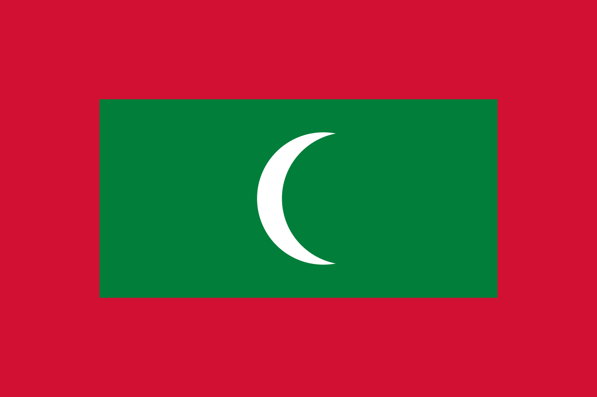
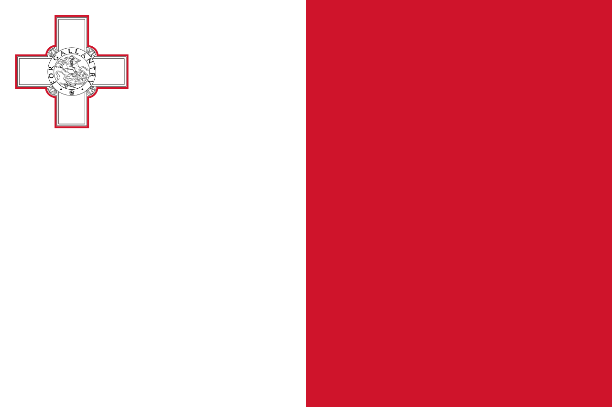

# Haïti

### 

Haïti est un pays des Grandes Antilles occupant le tiers occidental de l'île d'Haïti, bordé au nord par l'océan Atlantique, à l'est par la République dominicaine, au sud par la mer des Caraïbes et à l'ouest par le canal du Vent, qui sépare l'île de Cuba.

Le pays s'étend sur 27 750 km2. Sa capitale, Port-au-Prince, est située au fond du golfe de la Gonâve.
Dans cette ile vous avez deux choix retournez en arrière vers Malte ou avancez vers les Maldives. Attention sa chauffe, vous vous rapprochez de l'arrivée !

Vous pouvez soit retourner à Malte ou soit aller à la prochaine destination.

### Destination
Maldives | Malte 
:----:|:--:
<a href=https://github.com/ssagnane1/tp2-labyrinthe/blob/main/jeu-heros-sdc/Maldives.md>  | <a href=https://github.com/ssagnane1/tp2-labyrinthe/blob/main/jeu-heros-sdc/Malte.md> 

Christopher MERVILON
