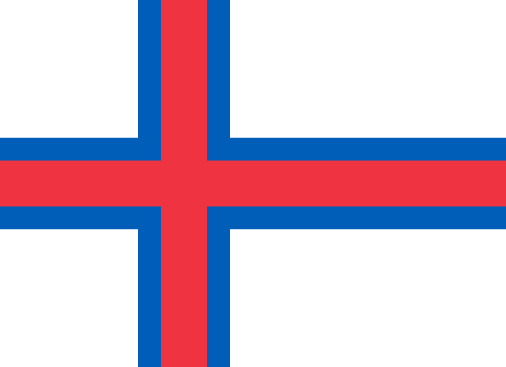

# Maldives

### 

Les Maldives, en forme longue la république des Maldives, est un pays d'Asie du Sud composé de 1 199 îles, dont 202 habitées, situé au sud-ouest du sous-continent indien. Les îles sont regroupées en vingt-six atolls et trois îles isolées réparties en vingt subdivisions appelées elles aussi « atoll » et portant chacune le nom d'une lettre thâna.

Très touristique, le pays fait cependant l'objet de critiques régulières concernant la situation des droits de l'homme et des libertés religieuses. 

Vous êtes proches de la fin, vous avez le choix de retourner en Haïti ou soit sortir de cette labyrinthe en prenant une nouvelle destination.

### Destination
Haïti | les Îles Féroés  
:----:|:--:|
<a href=https://github.com/ssagnane1/tp2-labyrinthe/blob/main/jeu-heros-sdc/Haiti.md>  | <a href=https://github.com/ssagnane1/tp2-labyrinthe/blob/main/jeu-heros-sdc/Féroé.md>  

 
SAGNANE Saïdou
