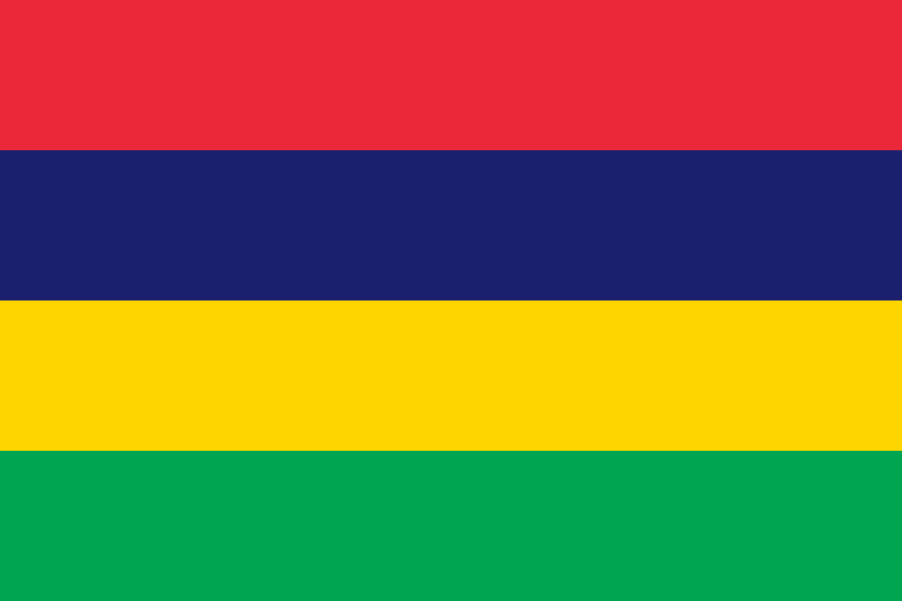
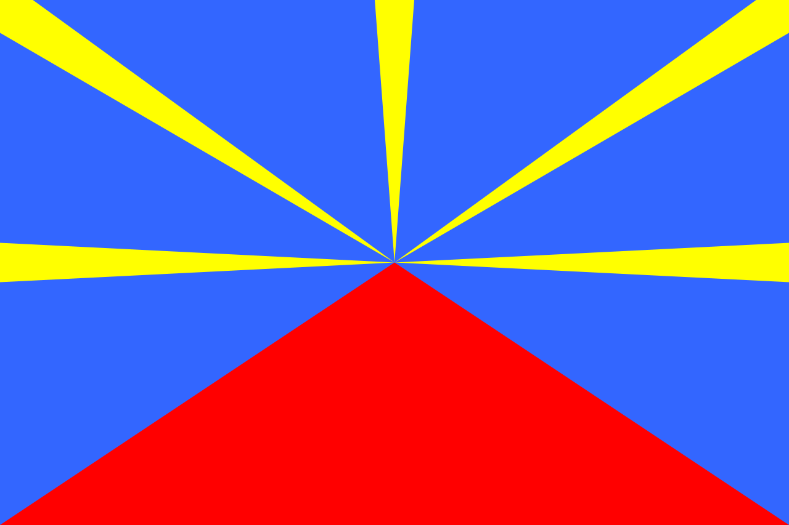

# Île Maurice

### 

L'île Maurice (Moris en créole mauricien), autrefois appelée l'isle de France (1717-1814), Mauritius en anglais, est l'île principale de la république de Maurice. Elle est rattachée géographiquement à l'Afrique et est située dans l'Ouest de l'océan Indien, au cœur de l'archipel des Mascareignes, entre La Réunion à l'ouest et l'île Rodrigues à l'est. 

Vous venez de commencez alors vous pouvez aller que vers l'ile de la réuinion. Bonne chance ! 

### Destination
Réunion | 
:----:|
<a href=https://github.com/ssagnane1/tp2-labyrinthe/blob/main/jeu-heros-sdc/Réunion.md>  | 

Christopher MERVILON
