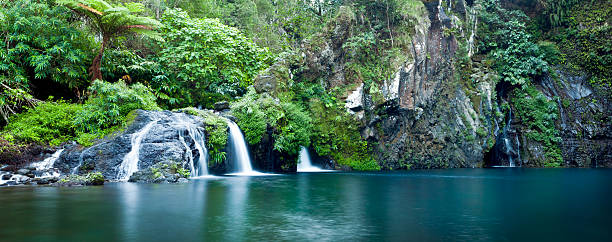
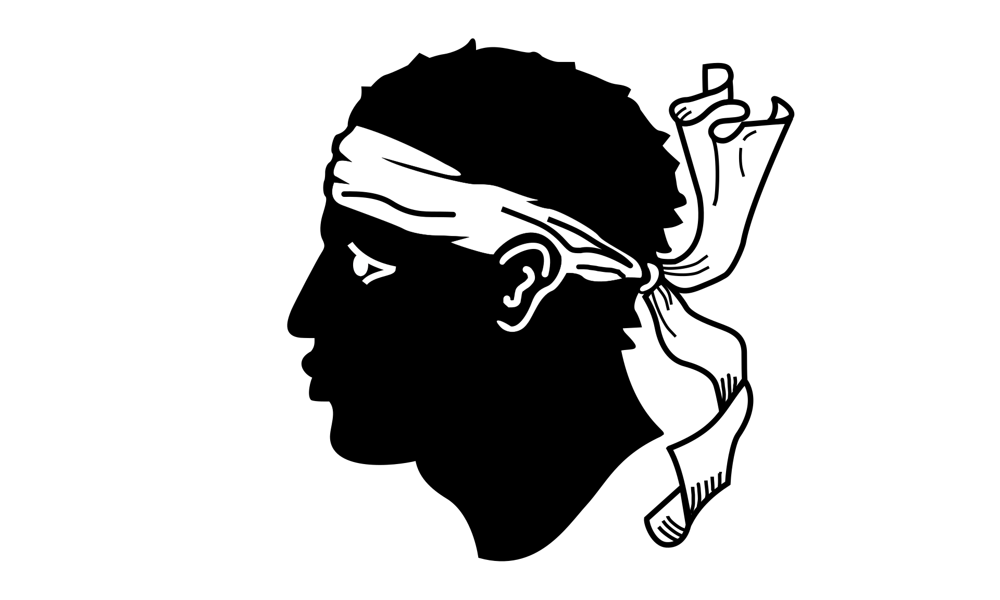

# Île de la Réunion

### 

La Réunion est une île située dans l'ouest de l'océan Indien, à l'est de l'Afrique, dans l'hémisphère sud. Elle constitue à la fois un département et une région d'outre-mer français (DROM).

D'une superficie de 2 512 km2, l'île de La Réunion est située dans l'archipel des Mascareignes à 172 km à l'ouest-sud-ouest de l'île Maurice et à 679 km à l'est-sud-est de Madagascar. Il s'agit d'une île volcanique créée par un point chaud. Le point culminant est à une altitude de 3 071 mètres au piton des Neiges2, elle présente un relief escarpé travaillé par une érosion très marquée. Le piton de la Fournaise (2 632 mètres), situé dans le sud-est de l'île, est un des volcans les plus actifs du monde. Bénéficiant d'un climat tropical d'alizé maritime et située sur la route des cyclones, La Réunion abrite un endémisme exceptionnel. 

Trois îles s'offrent à vous, la Corse, la Sicile et l'ile Maurice. Faites le bon choix, en fonction de votre choix vous retournerez vers le Depart mais vous serez aussi plus proche du Game Over.

### Destination
Corse | Sicile | Île Maurice 
:----:|:--:|:---:
<a href=https://github.com/ssagnane1/tp2-labyrinthe/blob/main/jeu-heros-sdc/Corse.md>  | <a href=https://github.com/ssagnane1/tp2-labyrinthe/blob/main/jeu-heros-sdc/Sicile.md>  | <a href=https://github.com/ssagnane1/tp2-labyrinthe/blob/main/jeu-heros-sdc/Maurice.md> 

Christopher MERVILON
