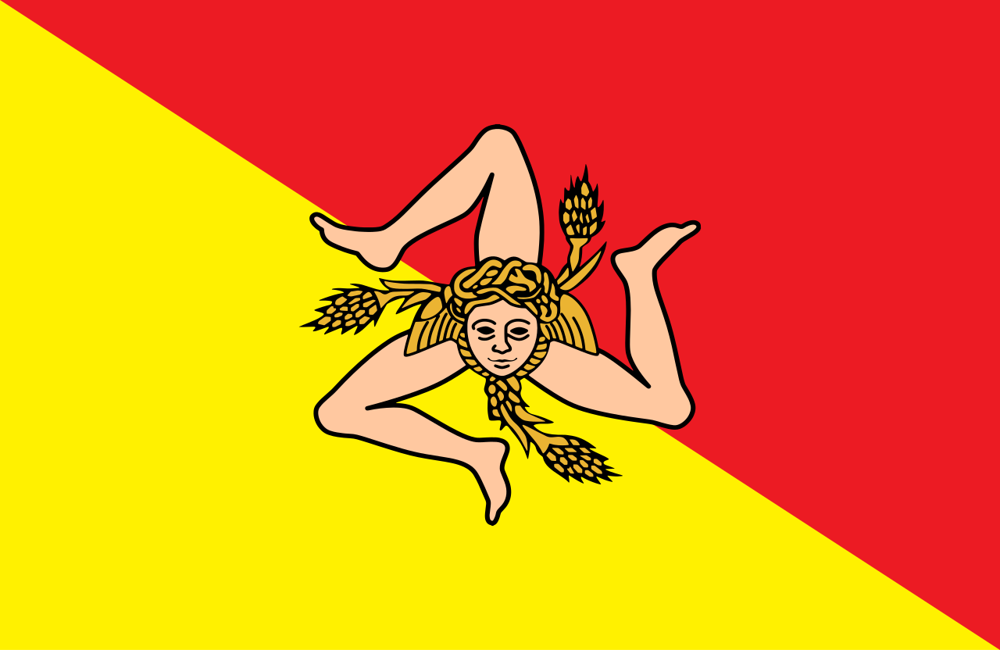

# Sicile

### 

La Sicile (en sicilien et en italien : Sicilia, /siˈtʃiːlja/) est la plus grande île méditerranéenne ainsi que l'une des vingt régions d'Italie formée par cette île, qui en représente 98 % du territoire, et par les îles Éoliennes, Égades, Pélages, Ustica et Pantelleria.

Depuis 1946, elle est l'une des cinq régions autonomes italiennes dénommée officiellement Regione Siciliana. 

Une fois arrivée sur cette ile vous trouvez une porte cachée comme si quelqu'un voulait la garder secrète. Vous l'ouvrez ?

### Destination
Clé secrète |
:----:|
<a href=https://github.com/Doothrat/TP2-Labyrinthe/blob/main/index.md>  |

SAGNANE Saïdou
